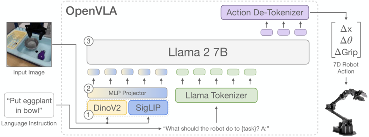
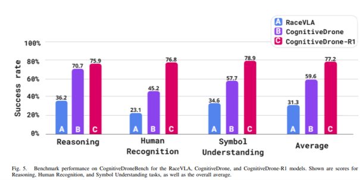

# Düşünen Dronelar: Otonomi Mutfağında VLA ve CognitiveDrone Devrimi

## 📌 İçindekiler
1. OpenVLA: Açık Kaynaklı VLA Temel Modeli
2. CognitiveDrone ve CognitiveDrone-R1 Mimarisi
3. CognitiveDroneBench Test Ortamı ve Veri Kümesi
4. Akıl Yürütme Tabanlı VLA ve UAV Uygulamaları
5. En İyi VLA Modelleri Kıyaslaması
6. Kaynakça

---

## 1. OpenVLA: Açık Kaynaklı VLA Temel Modeli
VLA ve Reasoning-VLA modellerinin teorik altyapısı detaylıca incelendikten sonra sıradaki adımımız, öne çıkan başarılı modelleri ve bunların entegre edildiği otonom sistemleri ele almaktır. Bu doğrultuda; saf bir eylem omurgası sunan açık kaynaklı OpenVLA temel modelini ve bu modelin önüne bir akıl yürütme katmanı (Reasoner) eklenerek güçlü bir Reasoning-VLA sistemine dönüştürülen CognitiveDrone-R1 mimarisini inceleyeceğiz.

OpenVLA, robotik alanında kullanılmak üzere geliştirilmiş, açık kaynaklı bir VLA temel modelidir. Temel olarak bir robotun çevresini görmesini, kendisine verilen doğal dildeki komutları anlamasını ve bu doğrultuda motor hareketlerini tetikleyecek eylemleri üretmesini sağlar. Bu model, robotik manipülasyon yeteneklerini geliştirmek amacıyla Stanford Üniversitesi, UC Berkeley, Google DeepMind, Toyota Research Institute (TRI) ve MIT gibi dünyanın önde gelen laboratuvarlarındaki araştırmacılardan oluşan ortak bir konsorsiyum (Moo Jin Kim, Karl Pertsch, Siddharth Karamcheti vb.) tarafından geliştirilmiştir.

* **Geliştirilme Süreci:** OpenVLA, sıfırdan bir model eğitmek yerine, internet üzerinde devasa verilerle önceden eğitilmiş güçlü Görsel-Dil Modellerini (VLM) temel alıp, bunları robotik eylemleri tahmin edecek şekilde uçtan uca eğiterek geliştirilmiştir.
* **Temel Alınan Mimari:** Model, Meta'nın Llama-2 (7B) büyük dil modelini omurga olarak kullanır. Görsel girdileri işlemek için ise mekânsal akıl yürütme sağlayan DINOv2 ile semantik (anlamsal) hizalama sunan SigLIP görsel kodlayıcılarının kombinasyonundan yararlanır. Bu yapı Prismatic VLM çerçevesi altında birleştirilmiştir.

  

* **Eğitim Verisi:** Robotun ne yapacağını anlaması için model, Open X-Embodiment veri setindeki 22 farklı robot platformundan toplanan yaklaşık 970.000 gerçek dünyaya ait video ve eylem kayıtları ile önceden eğitilmiştir.
* **Açık Kaynak Yaklaşımı:** Modelin ağırlıkları, PyTorch eğitim hattı ve veri işleme araçları Hugging Face ve GitHub platformları üzerinden tamamen açık kaynaklı olarak paylaşılmıştır. Bu sayede, modelin yeni bir robota uyarlanması istendiğinde standart tüketici GPU’larında bile LoRA gibi yöntemlerle hızlıca ince ayar (fine-tuning) yapılabilmektedir.

Günümüzde OpenVLA'in omurga model olarak kullanıldığı, üzerine akıl yürütme katmanlarının eklendiği güçlü Reasoning-VLA mimarileri mevcuttur. Şimdi bu sistemlerin en başarılı örneklerinden biri olan CognitiveDrone mimarisine odaklanacağız.

---

## 2. CognitiveDrone ve CognitiveDrone-R1 Mimarisi
CognitiveDrone, birinci şahıs görüşü (FPV) kameralarından gelen görsel verileri ve doğal dil talimatlarını doğrudan uçuş kontrol komutlarına dönüştüren, hava robotlarına üst seviye bilişsel karar verme yeteneği kazandırmak amacıyla geliştirilmiş uçtan uca bir Görsel-Dil-Eylem (VLA) mimarisidir.

Klasik otonom İHA yaklaşımları (RaceVLA gibi salt yarış odaklı modeller dahil) yüksek hızlı dinamik uçuşta başarılı olsa da sembol anlama, insan tanıma ve mantıksal çıkarım gibi üst düzey bilişsel görevleri yerine getiremez. CognitiveDrone, bu kısıtları aşmak için 7 milyar parametreli bir VLA modeli kullanır ve doğrudan 4 boyutlu sürekli eylem vektörleri (v_x, v_y, v_z, ω - üç eksenli hız ve sapma/yaw açısal hızı) üretir. Mimari iki farklı yapılandırmayla sunulmaktadır:

* **CognitiveDrone (Temel Model):** Tek parçalı (monolithic) 7B VLA omurgasıyla görsel-dilsel girdileri doğrudan 10 Hz frekansta reaktif uçuş komutlarına eşler.
* **CognitiveDrone-R1 (Gelişmiş Model):** Hızlı kontrol ile derin muhakemeyi ayıran çift sistemli (System 1 / System 2) bir yaklaşıma sahiptir:
  * **Akıl Yürütme Modeli (Reasoner - Sistem 2):** Ortamı ve karmaşık yönergeyi analiz edip Düşünce Zinciri (Chain-of-Thought / CoT) ile ara çıkarımlar üreten 7B parametreli bir VLM muhakeme modülü (~2 Hz).
  * **Eylem Modeli (Controller / Executor - Sistem 1):** Birinci modülden gelen sadeleştirilmiş mantıksal hedefi alıp 10 Hz'de dinamik uçuş komutlarına dönüştüren 7B OpenVLA tabanlı kontrol modeli.

CognitiveDrone’un Eylem Modeli'nden (Sistem 1) 10 Hz frekansında çıkan 4 boyutlu sürekli eylem vektörleri (v_x, v_y, v_z, ω), doğrudan motor sürücülerine iletilmez. Üst düzey otonomi bilgisayarında koşan ROS 2 düğümleri (nodes), hesaplanan bu referans hız ve sapma komutlarını CAN Bus iletişim ağı üzerinden alt seviye Araç Kontrol Ünitesine aktarır. Genellikle C ve C++ ile programlanmış, FreeRTOS tabanlı bir STM32 mikrodenetleyicisinin merkezinde bulunduğu bu VCU; ROS 2'den gelen komutları alır, DMA ile arabelleğe alıp güvenlik filtrelerinden geçirir ve milisaniyelik hassasiyetle fiziksel eyleyicilere dağıtır. Böylece devasa yapay zeka omurgası ile fiziksel donanım arasındaki o kritik köprü, kesintisiz ve deterministik bir şekilde kurulmuş olur.

Sistem, görevi önce akıl yürütme katmanında çözüp ardından eylem katmanına aktaran iki kademeli (7B + 7B) ardışık bir boru hattı (pipeline) ile çalışır[cite: 1].

  

---

## 3. CognitiveDroneBench Test Ortamı ve Veri Kümesi
Modelin eğitimi için üç ana bilişsel kategoriyi kapsayan 8.000'den fazla simüle edilmiş uçuş yörüngesi toplanmıştır:
* **İnsan Tanıma (Human Recognition):** Giyim, duruş ve tanımlayıcı görsel özelliklere göre hedeflenen kişiyi tespit etme.
* **Sembol / İşaret Anlama (Symbol Understanding):** Geometrik şekilleri, işaret levhalarını ve yönlendirici sembolleri ayırt etme.
* **Mantıksal Akıl Yürütme (Reasoning):** Çok adımlı bulmacaları ve bağlamsal yönergeleri çözerek doğru rotayı ve geçiş kapısını belirleme[cite: 1].

CognitiveDroneBench testlerinde salt yarış odaklı RaceVLA modeli bilişsel görevlerde %31.3 başarı oranında kalırken; temel CognitiveDrone modeli %59.6, akıl yürütme katmanına sahip CognitiveDrone-R1 ise %77.2 genel başarı oranına ulaşarak muhakeme yeteneğinin önemini doğrulamıştır.

Açık kaynaklı olarak sunulan CognitiveDroneBench, ROS ve Gazebo simülasyonu üzerinde inşa edilmiştir. İHA, klasik yarış kapılarından oluşan parkurda ilerlerken her kapı ayrımında karşısına çıkan görsel-bilişsel görevi doğru çözüp uygun kapıdan geçmek zorundadır.

| Özellik | OpenVLA (Geleneksel VLA) | Reasoning VLA (Örn: DeepThinkVLA) |
| :--- | :--- | :--- |
| **Çalışma Biçimi** | Reaktif (Algıla ve hemen hareket et) | Deliberative (Önce düşün, sonra hareket et) |
| **Çıktı Süreci** | Görüntü/Dil ➔ Doğrudan Eylem Token'ları | Görüntü/Dil ➔ Akıl Yürütme Zinciri ➔ Eylem Token'ları |
| **Karmaşık Görevler** | Çok adımlı mantıksal çıkarımlarda zorlanabilir. | Alışılmadık senaryolarda ve uzun vadeli planlamalarda çok daha başarılıdır. |

---

## 4. Akıl Yürütme Tabanlı VLA ve UAV Uygulamaları

### Çeşitli Akıl Yürütme Tabanlı VLA (Reasoning-VLA) Modelleri ve Mimari Yaklaşımlar
Görsel-Dil-Eylem (VLA) literatüründe son dönemde öne çıkan en belirgin değişim, doğrudan algıla-eyleme dök eşlemesi yapan uçtan uca modellerden, karar sürecine açık ara basamaklar ekleyen akıl yürütme tabanlı mimarilere geçiştir. Bu doğrultuda geliştirilen modeller; ara planlama adımlarını modelleme biçimlerine, mekânsal algı entegrasyonlarına ve eylem üretim hızlarına göre farklı yaklaşımlar sergilemektedir.

Akıl yürütme tabanlı VLA mimarilerinin kazandığı bu esneklik, modellerin yalnızca tek kollu masaüstü robotlarla veya kara taşıtlarıyla sınırlı kalmayıp, çok daha karmaşık dinamiklere sahip platformlara genişlemesini sağlamıştır. Güncel literatürde özellikle çift kollu robotik manipülasyon (bimanual manipulation) ile insansız hava araçları (İHA / UAV), VLA modellerinin çoklu serbestlik derecesi (DoF) ve eş zamanlı koordinasyon yeteneklerini test eden iki ana odak alanı haline gelmiştir.

İki robot kolunun giysi katlama veya mekanik montaj gibi görevlerde senkronize çalışması ile bir hava aracının uçuş dinamiklerini kontrol ederken üzerindeki manipülatörle nesne yakalaması (aerial manipulation), yapısal ve matematiksel olarak büyük benzerlikler taşır. Her iki senaryoda da sistem, tekil bir görsel-dilsel hedeften beslenerek birbiriyle yüksek derecede eşlenik (coupled) çoklu eylem yörüngeleri üretmek zorundadır.

Bu tür yüksek serbestlik dereceli ve hızlı sistemlerde, standart otoregresif eylem başlıklarının yol açtığı kuantizasyon kayıpları ile difüzyon modellerinin getirdiği yüksek çıkarım gecikmelerini aşmak adına akış eşleştirme (flow matching) ve sürekli eylem parçalama (action chunking) paradigmaları benimsenmektedir. Bu sayede model, üst seviye görsel-dilsel akıl yürütmeyi kesintiye uğratmadan yüksek frekansta (20–50 Hz) pürüzsüz ve gerçek zamanlı motor komutları üretebilmektedir.

Ayrıca bu alandaki güncel yaklaşımlar, farklı kinematik yapılardan ve sensör konfigürasyonlarından gelen verilerle ortak eğitim (cross-embodiment co-training) yapmanın model genellemesini ciddi ölçüde artırdığını göstermektedir. Üst seviyede semantik muhakeme ve rota planlaması yürüten "yavaş" bir görsel-dil omurgası ile alt seviyede milisaniyelik dinamik kararları icra eden "hızlı" bir politika başlığından oluşan iki kademeli (dual-system) mimariler; İHA'ların zorlu rüzgâr/uçuş dinamiklerinde güvenli, sağlam ve uyarlanabilir bir fiziksel yapay zekâ altyapısı sunmaktadır.

### İnsansız Hava Araçlarında (UAV / Drone) VLA ve Öğrenilmiş Kontrol Sistemleri
Hava robotlarında VLA modelleri, milisaniyelik gecikme kısıtları ($\ge 100\text{ Hz}$) ve dış mekânın 3 boyutlu dinamik koşulları altında uçuş komutları ve görev planlaması üretmektedir:

* **Uçtan Uca Görsel-Dilsel Navigasyon (UAV-VLA, CognitiveDrone, RaceVLA):** UAV-VLA, uydu ve hava görüntülerini işleyerek doğal dilden 100 bin uçuşluk görev planı (irtifa, rota, sensör ayarları) üretebilmektedir. CognitiveDrone, birinci şahıs kamerasından doğrudan 4B eylem ($x, y, z, \text{yaw}$) üretirken; Düşünce Zinciri (CoT) muhakemesi eklenen R1 varyantıyla karmaşık bilişsel görevleri çözer. RaceVLA ise uzman pilot verilerini "agresif apeks dönüşü" gibi sözel komutlarla eşleyerek insan benzeri yarış yörüngeleri oluşturur.
* **Hava Manipülasyonu ve Çift Kol Entegrasyonu (DroneVLA, AIR-VLA, Flying Hand):** Hava araçlarının yalnızca uçmayıp uçarken manipülatörle nesne yakalamasını sağlayan DroneVLA, açık sözlüklü nesne tespiti (Grounding DINO) ile görsel servoyu birleştirir. AIR-VLA, hava manipülasyonu için 3000 gösterimlik güvenlik kısıtlı bir test ortamı sunar. Flying Hand ise tam tahrikli bir hekzarotor üzerine 4-DoF kol yerleştirerek, manipülasyonda kullanılan ACT (Action Chunking with Transformers) yönteminin doğrudan hava araçlarına aktarılabileceğini kanıtlamıştır. Ayrıca çift kollu hava manipülasyonu (Aerial Bimanual Harvesting), avokado hasadı gibi görevlerde bir kolun dalı sabitleyip diğer kolun meyveyi kopardığı lider-takipçi stratejisini başarıyla uygulamaktadır.
* **Düşük Gecikmeli Görev Planlama (TypeFly, AeroAgent):** LLM'lerin serbest kod üretimindeki gecikmeyi azaltmak için TypeFly, modeli MiniSpec adı verilen yalın bir drone komut dilinde çıktı üretmeye kısıtlayarak planlama gecikmesini 500 ms'nin altına indirmiştir.

---

## 5. En İyi VLA Modelleri Kıyaslaması

| Model | Parametreler | Lisans | Aksiyon başlığı | Donanım | En iyisi |
| :--- | :--- | :--- | :--- | :--- | :--- |
| **OpenVLA** | 7B | MIT | Ayrık token'lar | A100/H100 | Dil temelli manipülasyon |
| **Octo** | 27M / 93M | MIT | Difüzyon | RTX 4090 | Cross-embodiment, yüksek frekans |
| **$\pi_0$ (pi0)** | Çoklu-B | Kısmi | Akış eşleştirme | Çoklu GPU | Becerikli uzun ufuklu |
| **RT-1-X** | ~35M | Apache 2.0 | Ayrık token'lar | Tek GPU | Küçük tarihsel temel |
| **Diffusion Policy** | Yapılandırılabilir | MIT | DDPM parçaları | Tek GPU | Çok modlu taklit |
| **ACT** | Yapılandırılabilir | MIT | CVAE parçaları | Tek GPU | İki elle yapılan teleop |
| **InternVLA-M1** | Açık | MIT | Temel eylem | A100 | Mekânsal olarak hassas görevler |
| **SmolVLA** | 450M | Apache 2.0 | Parçalı | Dizüstü bilgisayar GPU'su | Hobi / uç robotlar |

Açık ağırlıklı temel modeller sınıfında OpenVLA, sektörün varsayılan başlangıç standardı konumundadır. Llama-2 7B omurgasını DINOv2 ve SigLIP görsel kodlayıcılarıyla birleştiren ve Open X-Embodiment veri kümesindeki 970.000 yörüngeyle eğitilen model, eylemleri ayrık tokenlar olarak tahmin etmektedir. OpenVLA'nın en çarpıcı yönü, kendisinden 7 kat daha büyük olan RT-2-X'i LIBERO gibi zorlu kıyaslamalarda geride bırakmasıdır. bfloat16 hassasiyetinde yaklaşık 16 GB bellek gerektiren model, tam ince ayar ve 5–10 Hz çıkarım için tek bir A100 veya H100 sınıfı GPU isterken; 4-bit nicelleştirilmiş sürümleri ve LoRA adaptörleri sayesinde tek bir tüketici sınıfı RTX 4090 üzerinde de çalışabilmektedir. Bu donanım esnekliği ve MIT lisansı, OpenVLA'yı ticari girişimlerin ve araştırma ekiplerinin ilk tercihi haline getirmektedir.

Büyük parametreli modellerin getirdiği donanım maliyetini karşılayamayan veya yüksek kontrol frekansına ihtiyaç duyan sistemler için Octo ve SmolVLA öne çıkmaktadır. Octo, 27M ve 93M parametreli hafif Transformatör difüzyon mimarisiyle yaklaşık 800.000 OpenX yörüngesi üzerinden sıfırdan eğitilmiştir ve tek bir RTX 4090 üzerinde 20–30 Hz hızında çalışabilmektedir. Esnek eylem uzayı ve hedef görüntüyle şartlandırma desteği sunan Octo, doğrudan uç bilişim cihazlarında (Edge devices) çalıştırılabilecek en dengeli alternatiftir. Hugging Face'in LeRobot çatısı altında sunduğu 450M parametreli SmolVLA ise veri merkezi GPU'larına bağımlılığı tamamen ortadan kaldırarak dizüstü bilgisayarlarda ve düşük maliyetli hobi robotlarında çalışmak üzere optimize edilmiş, entegre veri yükleme boru hatlarına sahip hafif bir çözümdür.

Hüner gerektiren, temas odaklı ve uzun ufuklu görevlerde ise Physical Intelligence tarafından geliştirilen $\pi_0$ (pi-zero) ile Şanghay Yapay Zeka Laboratuvarı'nın InternVLA-M1 modeli liderliği üstlenmektedir. $\pi_0$, eylem başlığında akış eşleştirme (flow matching) mekanizmasını kullanarak çamaşır katlama veya kutu montajı gibi ince el becerisi isteyen alanlarda çığır açıcı bir başarı sergilemektedir; yığının ve ağırlıkların belirli kısımları paylaşıldığı için insansı ve çift kollu robot projelerinde yakından izlenen amiral gemisi konumundadır. InternVLA-M1 ise eylem kestiriminden önce ara bir temsil olarak uzamsal zeminlemeyi (spatial grounding) devreye sokan iki aşamalı yaklaşımıyla ayrışmaktadır. Bu uzamsal ara basamak sayesinde Google Robot ortamında %71–81, LIBERO kıyaslamasında ise %95,9 gibi açık ağırlıklı modeller arasındaki en yüksek başarı oranlarından birini elde etmiştir.

Taklit öğrenme tarafında ACT (Action Chunking with Transformers) ve Diffusion Policy, modern VLA mimarilerinin temel yapı taşlarına dönüşmüştür. Mobile ALOHA projesinden doğan ACT, CVAE tabanlı eylem parçalama ve zamansal toplama (Temporal ensembling) stratejisiyle yalnızca 50 insan gösterimiyle bile dakikalar içinde eğitilebilmekte ve iki elle uzaktan kumanda (teleoperasyon) için fiili standart olmaya devam etmektedir. Columbia Üniversitesi'nin Diffusion Policy modeli ise DDPM tabanlı gürültü giderme başlığı sayesinde çok modlu uzman gösterimlerinin ortalamasını alıp davranışı çökertmek yerine çoklu çözüm yollarını pürüzsüzce modellemekte, böylece temas açısından zengin görevlerde önceki yöntemlere kıyasla %46,9'luk bir sıçrama sağlamaktadır. Tarihsel referans olarak konumlanan 35M parametreli RT-1-X ise OpenX üzerinde yeniden eğitilmiş hafif yapısıyla akademik karşılaştırmalarda baz model rolünü sürdürmektedir.

2024'ten 2026'ya uzanan süreçte yaşanan en kritik mimari değişim, taklit öğrenme algoritmaları ile büyük dil modellerinin hibrit bir yapıda birleşmesidir. Günümüzde üretim odaklı ekipler tek parçalı devasa bir VLA yerine iki katmanlı bir iş bölümü tercih etmektedir: Dil anlama ve yüksek seviyeli sahne kavrayışı için ön uçta OpenVLA veya Octo gibi bir VLA çalışırken, milisaniyelik motor komutlarını ve fiziksel teması yöneten arka uçta ACT veya Diffusion Policy gibi dar, yüksek frekanslı bir politika yer almaktadır. Aynı zamanda modeller arasındaki performans farkı kapandığı için asıl darboğaz mimariden ziyade veri kalitesine kaymıştır; tutarlı kamera açıları, disiplinli teleoperasyon kayıtları ve temiz alt görev sınıflandırmaları, başarılı bir robotik dağıtımın en belirleyici unsuru haline gelmiştir.

---

## 6. Kaynakça
[1] A. Lykov ve diğ., "CognitiveDrone: A VLA Model and Evaluation Benchmark for Real-Time Cognitive Task Solving and Reasoning in UAVs," arXiv preprint arXiv:2503.01378v1, 3 Mart 2025.

[2] A. Lykov ve diğ., "CognitiveDrone: A VLA Model and Evaluation Benchmark for Real-Time Cognitive Task Solving and Reasoning in UAVs," Hugging Face Papers, 6 Mart 2025. [Çevrimiçi]. Erişilebilir: https://huggingface.co/papers/2503.01378

[3] wazder, "CognitiveDrone Enhanced Reasoning Pipeline," GitHub Repository, 2026. [Çevrimiçi]. Erişilebilir: https://github.com/wazder/cognitive-drone

[4] Robotics Center, "Best VLA Models 2026: Complete Vision-Language-Action Guide," Robotics Center Guides, Nisan 2026. [Çevrimiçi]. Erişilebilir: https://www.roboticscenter.ai/vla-models/best-2026

[5] OpenVLA Team, "OpenVLA-7B Model Card," Hugging Face Hub, 2024. [Çevrimiçi]. Erişilebilir: https://huggingface.co/openvla/openvla-7b

[6] IBM, "What is Chain-of-Thought Prompting?," IBM Think Topics, 2026. [Çevrimiçi]. Erişilebilir: https://www.ibm.com/think/topics/chain-of-thoughts

[7] Z. Yuan ve diğ., "AutoDrive-R: Incentivizing Reasoning and Self-Reflection Capacity for VLA Model in Autonomous Driving," arXiv preprint arXiv:2506.08045v1, Haziran 2025.

[8] DeepLearning.AI, "The Batch: Reasoning Models Transformation," DeepLearning.AI Newsletters, 2025. [Çevrimiçi]. Erişilebilir: https://www.deeplearning.ai/the-batch/reasoning-models-beginning-with-openais-o1-and-deepseeks-r1-transformed-the-industry

[9] A. Lykov ve diğ., "CognitiveDrone Project Page and Benchmark Environment," CognitiveDrone GitHub Pages, Mart 2025. [Çevrimiçi]. Erişilebilir: https://cognitivedrone.github.io/

[10] X. Wang ve diğ., "A Comprehensive Survey and Reference Architecture for AI-Powered Autonomous Drone Systems in Smart Cities," ResearchGate Technical Reports, 2025. [Çevrimiçi]. Erişilebilir: http://www.researchgate.net/

[11] M. J. Kim ve diğ., "OpenVLA: An Open-Source Vision-Language-Action Model," arXiv preprint arXiv:2406.09246, 2024. [Çevrimiçi]. Erişilebilir: https://huggingface.co/openvla/openvla-7b

[12] Emergent Mind, "OpenVLA: Open Source VLA for Robotics," Emergent Mind Topics, 6 Ekim 2025. [Çevrimiçi]. Erişilebilir: https://www.emergentmind.com/topics/openvla

