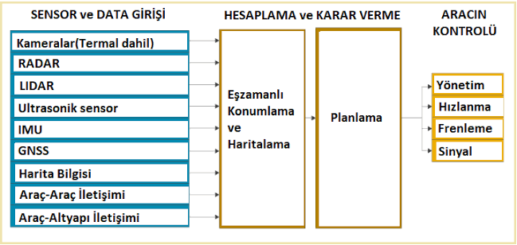

# İnsansız Hava Araçlarında Geçmişten Günümüze Yazılım Teknolojileri ve Yazılım Mimarisi

## 📌 İçindekiler
1. [Giriş ve Klasik Otonom Yaklaşımı](#1-giriş-ve-klasik-otonom-yaklaşımı)
2. [VLA ve Reasoning VLA Mimarileri](#2-vla-ve-reasoning-vla-mimarileri)
3. [Chain-of-Thought (CoT) ve Akıl Yürütme Modelleri](#3-chain-of-thought-cot-ve-akıl-yürütme-modelleri)
4. [Akıl Yürütme Tabanlı VLA ve UAV Uygulamaları](#4-akıl-yürütme-tabanlı-vla-ve-uav-uygulamaları)
5. [Kaynakça](#5-kaynakça)

---

## 1. Giriş ve Klasik Otonom Yaklaşımı
Geçmişten günümüze insansız hava araçlarında kullanılan yazılım mimarilerinden ilki, perception (algılama), SLAM (Eş Zamanlı Konum Belirleme ve Haritalama), kontrol şeklinde 3 ayrı katmana bölünmüş klasik otonom yaklaşımıdır. Bu mimaride perception, sensörler aracılığı ile çevreyi algılayıp bu sensörlerin sağladığı ham veriyi işleyerek kullanılabilir hale getirir. Buna örnek olarak LiDAR sensöründen gelen ham nokta bulutlarının (point cloud) işlenerek kümelenmesi (clustering) ve çevredeki objelerin anlamlandırılması gibi görevler verilebilir. Bu örnek, perception katmanının en minimal işlerinden biridir. Derin öğrenmeye dayalı görüntü işleme ve bilgisayarlı görü teknolojilerinin hepsine bu katmanda yer veririz. Sözün özü, otonoma yapay zekanın dahil olduğu ilk katman burasıdır.

Kontrol katmanı, üst düzey otonomi yazılımı ile fiziksel donanım arasındaki köprü görevini üstlenerek aracın dinamik hareketlerini yönetir. Kontrol katmanının tüm başarısı SLAM katmanına bağlıdır. Konumu yeterli doğruluk ile tespit edilemeyen cihazı, yeterli doğruluk ile kontrol etmek mümkün değildir. SLAM katmanının görevi olan state estimation ve EKF gibi algoritmalar üzerinden edinilen bilgiler üstüne inşa edilen kontrol katmanı pure pursuit, PID, MPC, NMPC gibi ağır matematiksel algoritmaları kullanarak otonom cihazı kontrol eder.

  

Klasik otonomiden bu yana yaşanan en büyük değişimler, önce sadece perception katmanına yapay zekanın dahil olması, sonra ise adım adım ara katmanlara da yapay zekanın entegre edilmesidir. Tüm bu çalışmalar, otonom geliştiricileri tüm sistemi yapay zeka üstüne inşa etmeye itmiştir. SLAM katmanı her zaman sistemde kritik bir konumda bulunurken algılama, planlama ve kontrol süreçlerini tek bir potada eriten yeni modeller sahneye çıkmıştır. 

Bununla birlikte, savunma sanayisi gibi otonom sistemlerden faydalanan kritik alanlarda 'sağlam matematik' ve klasik yöntemler hala ağırlıklı olarak tercih edilmektedir. Büyük bir yapay zeka modelinin yapabileceği en ufak bir hata veya göreceği bir halüsinasyon, göz ardı edilebilecek bir pürüz olmaktan çıkıp küresel ölçekte ciddi sorunlara yol açabilir. Taşıdığı bu riskler nedeniyle bazı endüstrilerde hala teoride veya laboratuvarda tutulan yapay zeka modelleri, diğer birçok alanda ise otonomi mutfağının en önemli baharatı haline gelmiştir. Görsel veriyi ve doğal dili işleyip doğrudan eyleme dönüştüren VLA (Vision-Language-Action) mimarisi, tam olarak bu baharatların en güçlülerinden biridir. Bu yazıda, fiziksel donanımımıza doğrudan temas etmesi ve dinamik karar mekanizmaları sunması nedeniyle odağımızı VLA modellerine çevireceğiz.

---

## 2. VLA ve Reasoning VLA Mimarileri
VLA (vision-language-action), görsel algıyı, dil anlama yeteneğini ve eyleme geçmeyi birleştiren bir yapay zeka modelidir[cite: 2]. Bu yapılar, üst seviye görsel-dilsel muhakeme yeteneğini hassas eylem yörüngelerine dönüştürerek hareket planlama ve kontrol süreçlerine esneklik ile uygulanabilirlik kazandırır[cite: 3].

VLA'lerin otonom sürüşte yaygınlaşması; çok adımlı çıkarım süreçlerinin gerçek zamanlı yüksek frekanslı kontrolü kısıtlaması, farklı araç ve senaryolara genelleme yapabilecek geniş ölçekli veri eksikliği ve mevcut ince ayar stratejilerinin yetersizliği nedeniyle sekteye uğramaktadır. Bu noktada devreye Reasoning VLA yani akıl yürütme temelli VLA modelleri devreye girer[cite: 3].

Reasoning VLA, görsel algıyı, dil anlama yeteneğini ve eylem planlamayı adım adım akıl yürütmeyle bütünleştiren birleşik bir yapay zeka modelidir[cite: 1, 3]. Yeni nesil akıl yürüten (Reasoning/Agentic) drone yapay zeka modelleri, geleneksel otonom uçuş algoritmalarından ve reaktif VLA modellerinden köklü bir mimari farkla ayrılır. Bu sistemler, OpenAI'ın o1/o3 veya DeepSeek-R1 gibi modellerde görülen Chain-of-Thought (Düşünce Zinciri) mantığını fiziksel dünyaya uyarlayan Embodied CoT (Fizikselleştirilmiş Akıl Yürütme) mimarisine dayanır. 

Drone'lar için geliştirilen akıl yürütme tabanlı yapay zeka mimarilerinin temel bileşenleri ve çalışma prensipleri şu şekildedir:

### Çift Katmanlı (Dual-Model) Hiyerarşik Mimari
* **Bilişsel Katman (Cognitive Core / Slow Thinking):** Üst düzey planlama, hazard (tehlike) analizi, semantik çıkarım ve rota optimizasyonunu yönetir. Görüntüyü ve görevi analiz edip, eyleme geçmeden önce kendi içinde bir "akıl yürütme zinciri" (CoT) kurar. 
* **Reaktif Katman (Control Core / Fast Thinking):** Bilişsel katmandan gelen basitleştirilmiş ve yapılandırılmış komutları alır, anlık olarak 4D uçuş koordinatlarına veya motor torkuna dönüştürür. 

### COMPASS (Bilişsel Operasyonlar Referans Mimarisi)
Akıllı şehirler veya karmaşık lojistik ağlarındaki drone'lar için geliştirilen COMPASS gibi yeni nesil 7 katmanlı teknik referans mimarileri, akıl yürütmeyi bir "Semantik Ara Katman" (Semantic Middleware Layer) olarak konumlandırır[cite: 1]. Bu katman, insandan gelen doğal dil komutunu alır, yasal havacılık kuralları (regülasyonlar) ve o anki drone batarya/hava durumu kısıtları ile çarpıştırarak arka planda semantik akıl yürütme gerçekleştirir. Edge computing (uç bilişim) donanımları üzerinde (örneğin Google Coral TPU veya gömülü güçlü GPU'lar) bu hafifletilmiş reasoning modelleri gerçek zamanlı koşturulabilir[cite: 1, 2]. 

### Özetle Mimari Fark:
Geleneksel dronelar sadece "görür ve kaçar" (Obstacle Avoidance). İlk nesil VLA droneları "anlar ve reaktif uçar". Yeni nesil akıl yürüten dronelar ise "görür, amaca giden adımları zihninde planlar, hatasını fark edip havada kararını değiştirir ve öyle uçar".

| Boyut / Kriter | Geleneksel İHA'lar | Agentic İHA'lar |
| :--- | :--- | :--- |
| **Algı Modalitesi** | Monoküler veya stereo RGB sensörler; temel multispektral veya termal kameralar; sınırlı anlamsal çözümleme. | Çok modlu algılama: RGB, termal, LiDAR, hiperspektral; VLM destekli anlamsal zeminleme (semantic grounding) |
| **Kontrol Mimarisi** | Kural tabanlı uçuş kontrolcüleri; waypoint takip eden otopilotlar. | Algı, planlama, bellek ve öz-değerlendirmeyi birleştiren katmanlı ajan kontrol döngüleri. |
| **Karar Sistemi** | Çıkarım yeteneği olmayan deterministik, scripted mantık | Pekiştirmeli öğrenme tabanlı karar motorları, hafıza destekli modüller, imkân farkındalıklı akıl yürütme. |
| **Otonomi Seviyesi** | Seviye 1–2 (Temel otonomi; döngüde insan operatör zorunludur). | Seviye 4–5 (Bağlam farkındalıklı otonomi; asgari insan denetimi). |
| **Görev Uyarlanabilirliği** | Statik görevler ve reaktif planlama içermeyen, önceden tanımlanmış operasyonlar. | Uçuş esnasında gerçek zamanlı yeniden önceliklendirme ve dinamik ortama uyum. |
| **Haberleşme Arayüzü** | Görüş hattı (LoS), tek yönlü telemetri veya yer kontrol istasyonu (GCS) telsiz bağı. | V2X ağları, sürü düzeyinde koordinasyon, uç-bulut (edge-cloud) senkronizasyonu. |

Yukarıdaki tabloda geleneksel İHA sistemleri ve Reasoning / Agentic İHA sistemleri arasındaki fark büyük ölçüde ortaya konmuştur. Reasoning insansız hava araçlarının altında yatan yazılımsal mantığı derinlemesine incelemeden önce safkan, klasik VLA modellerini inceleyeceğiz ki çok daha doğru bir anlam haritası çizebilelim.

---

## 3. Chain-of-Thought (CoT) ve Akıl Yürütme Modelleri
Chain-of-Thought (CoT) yani "Düşünce Zinciri" yöntemi, modelin "sesli düşünmesini" ve ara akıl yürütme adımları oluşturmasını sağlayarak, büyük dil modellerinin (LLM) karmaşık ve çok aşamalı görevlerdeki performansını artıran bir istem mühendisliği tekniğidir.

**Temel noktalar**
* Nasıl çalışır? – Tek bir istem, "akıl yürütme sürecini adım adım açıkla" gibi bir talimat içerir. Model, nihai cevabı vermeden önce tutarlı bir mantıksal adımlar dizisi oluşturur.
* Neden etkilidir? – Bir problemin daha küçük adımlara bölünmesi, akıl yürütme sürecini şeffaflaştırır, doğruluğu artırır ve insanların problem çözme biçimini taklit eder.

**Varyasyonlar**
* Zero-shot CoT: Model, herhangi bir örnek kullanmaksızın kendi içsel bilgisinden yararlanır.
* Otomatik CoT (auto-CoT): Akıl yürütme yolları otomatik olarak oluşturulur, böylece manuel istem tasarımı ihtiyacı azaltılır.
* Çok modlu (Multimodal) CoT: Daha zengin bir akıl yürütme süreci için metni görseller veya diğer veri türleriyle (modlarla) birleştirir.

**Avantajlar**
* Aritmetik, sağduyuya dayalı muhakeme ve sembolik akıl yürütme gibi görevlerde daha yüksek doğruluk.
* Görünür ara adımlar sayesinde daha fazla şeffaflık ve yorumlanabilirlik.
* Birçok alanda uygulanabilirlik (yapay zeka asistanları, müşteri hizmetleri botları, eğitim, araştırma, içerik üretimi, yapay zeka etiği vb.).

**Sınırlamalar**
* İyi kurgulanmış istemler gerektirir; zayıf istemler etkinliği azaltır. Birden fazla akıl yürütme adımı oluşturulduğu için hesaplama açısından daha maliyetlidir. Makul görünen ancak hatalı akıl yürütme süreçleri üretebilir ve niteliksel iyileştirmeleri değerlendirmek zor olabilir. Genel olarak CoT yöntemi, LLM'lerin insan benzeri akıl yürütme süreçlerini taklit etmesini sağlayarak karmaşık problemler için daha güvenilir ve açıklanabilir çıktılar sunar.

Geleneksel LLM'ler (System 1- Hızlı/Sezgisel): GPT-4, Llama gibi klasik modeller bir sonraki kelimeyi (token) anında tahmin ederek doğrudan yanıt üretir. Bu durum, özellikle çok adımlı matematik, mantık bulmacaları ve karmaşık kodlama görevlerinde yüzeysel kalmalarına veya halüsinasyon görmelerine yol açar.

Akıl Yürütme Modelleri (System 2- Yavaş/Düşünerek): Yanıtı hemen vermek yerine, arka planda kullanıcıya gösterilen veya gizlenen uzun bir Düşünce Zinciri üretirler. Kendi varsayımlarını test eder, alternatif yolları dener, hata yaptıklarında geri dönüp düzeltir (backtracking) ve ancak tatmin edici bir sonuca ulaştıklarında nihai cevabı sunarlar.

Yakın zamana kadar modelleri daha zeki kılmanın yolu ön eğitim aşamasında (pre-training) daha fazla veri ve daha fazla GPU kullanmaktan geçiyordu (Chinchilla / Scaling Laws). OpenAI o1 ve DeepSeek-R1 ile sektör çıkarım anında hesaplama (test-time compute) gücünün model zekâsını doğrudan artırdığını görmüştür. Model bir soruyu yanıtlarken ne kadar uzun süre "düşünürse" (ne kadar çok ara token harcarsa), karmaşık problemlerdeki doğruluk oranı o kadar yükselmektedir.

OpenAI o1, bu yeteneği kapalı kaynaklı, tescilli bir mimari ve API arkasında gizli düşünce zinciri token'larıyla piyasaya sundu. DeepSeek-R1, aynı akıl yürütme performansını büyük ölçüde saf pekiştirmeli öğrenme kullanarak ve arkasındaki düşünce süreçlerini tamamen açık ağırlıklı (open-weights) olarak topluluğa sundu.

DeepSeek-R1, büyük ön eğitim maliyetlerine gerek kalmadan, yalnızca uygun ödül sinyalleri ve RL ile modellerin "düşünmeyi kendi kendine keşfedebileceğini" kanıtlayarak bu teknolojiyi demokratikleştirdi. Robotik dünyası, saf reaktif eylem üretiminden (OpenVLA, ACT) çıkarak, karar öncesinde DeepSeek-R1 / o1 mantığında çalışan bir Sistem 2 akıl yürütme katmanı eklemeye bu sayede geçiş yapmıştır. Modelin adındaki "R1" takısı ve arkasındaki ~2 Hz'lik düşünme aşaması, doğrudan bu akıl yürütme devriminin fiziksel dünyaya (İHA ve robotlara) yansımasıdır.

---

## 4. Akıl Yürütme Tabanlı VLA ve UAV Uygulamaları

### Çeşitli Akıl Yürütme Tabanlı VLA (Reasoning-VLA) Modelleri ve Mimari Yaklaşımlar
Görsel-Dil-Eylem (VLA) literatüründe son dönemde öne çıkan en belirgin değişim, doğrudan algıla-eyleme dök eşlemesi yapan uçtan uca modellerden, karar sürecine açık ara basamaklar ekleyen akıl yürütme tabanlı mimarilere geçiştir. Bu doğrultuda geliştirilen modeller; ara planlama adımlarını modelleme biçimlerine, mekânsal algı entegrasyonlarına ve eylem üretim hızlarına göre farklı yaklaşımlar sergilemektedir[cite: 4].

Akıl yürütme tabanlı VLA mimarilerinin kazandığı bu esneklik, modellerin yalnızca tek kollu masaüstü robotlarla veya kara taşıtlarıyla sınırlı kalmayıp, çok daha karmaşık dinamiklere sahip platformlara genişlemesini sağlamıştır. Güncel literatürde özellikle çift kollu robotik manipülasyon (bimanual manipulation) ile insansız hava araçları (İHA / UAV), VLA modellerinin çoklu serbestlik derecesi (DoF) ve eş zamanlı koordinasyon yeteneklerini test eden iki ana odak alanı haline gelmiştir.

İki robot kolunun giysi katlama veya mekanik montaj gibi görevlerde senkronize çalışması ile bir hava aracının uçuş dinamiklerini kontrol ederken üzerindeki manipülatörle nesne yakalaması (aerial manipulation), yapısal ve matematiksel olarak büyük benzerlikler taşır. Her iki senaryoda da sistem, tekil bir görsel-dilsel hedeften beslenerek birbiriyle yüksek derecede eşlenik (coupled) çoklu eylem yörüngeleri üretmek zorundadır.

Bu tür yüksek serbestlik dereceli ve hızlı sistemlerde, standart otoregresif eylem başlıklarının yol açtığı kuantizasyon kayıpları ile difüzyon modellerinin getirdiği yüksek çıkarım gecikmelerini aşmak adına akış eşleştirme (flow matching) ve sürekli eylem parçalama (action chunking) paradigmaları benimsenmektedir. Bu sayede model, üst seviye görsel-dilsel akıl yürütmeyi kesintiye uğratmadan yüksek frekansta (20–50 Hz) pürüzsüz ve gerçek zamanlı motor komutları üretebilmektedir.

Ayrıca bu alandaki güncel yaklaşımlar, farklı kinematik yapılardan ve sensör konfigürasyonlarından gelen verilerle ortak eğitim (cross-embodiment co-training) yapmanın model genellemesini ciddi ölçüde artırdığını göstermektedir. Üst seviyede semantik muhakeme ve rota planlaması yürüten "yavaş" bir görsel-dil omurgası ile alt seviyede milisaniyelik dinamik kararları icra eden "hızlı" bir politika başlığından oluşan iki kademeli (dual-system) mimariler; İHA'ların zorlu rüzgâr/uçuş dinamiklerinde güvenli, sağlam ve uyarlanabilir bir fiziksel yapay zekâ altyapısı sunmaktadır.

### İnsansız Hava Araçlarında (UAV / Drone) VLA ve Öğrenilmiş Kontrol Sistemleri
Hava robotlarında VLA modelleri, milisaniyelik gecikme kısıtları ($\ge 100\text{ Hz}$) ve dış mekânın 3 boyutlu dinamik koşulları altında uçuş komutları ve görev planlaması üretmektedir:

* **Uçtan Uca Görsel-Dilsel Navigasyon (UAV-VLA, CognitiveDrone, RaceVLA):** UAV-VLA, uydu ve hava görüntülerini işleyerek doğal dilden 100 bin uçuşluk görev planı (irtifa, rota, sensör ayarları) üretebilmektedir. CognitiveDrone, birinci şahıs kamerasından doğrudan 4B eylem ($x, y, z, \text{yaw}$) üretirken; Düşünce Zinciri (CoT) muhakemesi eklenen R1 varyantıyla karmaşık bilişsel görevleri çözer. RaceVLA ise uzman pilot verilerini "agresif apeks dönüşü" gibi sözel komutlarla eşleyerek insan benzeri yarış yörüngeleri oluşturur.
* **Hava Manipülasyonu ve Çift Kol Entegrasyonu (DroneVLA, AIR-VLA, Flying Hand):** Hava araçlarının yalnızca uçmayıp uçarken manipülatörle nesne yakalamasını sağlayan DroneVLA, açık sözlüklü nesne tespiti (Grounding DINO) ile görsel servoyu birleştirir. AIR-VLA, hava manipülasyonu için 3000 gösterimlik güvenlik kısıtlı bir test ortamı sunar. Flying Hand ise tam tahrikli bir hekzarotor üzerine 4-DoF kol yerleştirerek, manipülasyonda kullanılan ACT (Action Chunking with Transformers) yönteminin doğrudan hava araçlarına aktarılabileceğini kanıtlamıştır. Ayrıca çift kollu hava manipülasyonu (Aerial Bimanual Harvesting), avokado hasadı gibi görevlerde bir kolun dalı sabitleyip diğer kolun meyveyi kopardığı lider-takipçi stratejisini başarıyla uygulamaktadır.
* **Düşük Gecikmeli Görev Planlama (TypeFly, AeroAgent):** LLM'lerin serbest kod üretimindeki gecikmeyi azaltmak için TypeFly, modeli MiniSpec adı verilen yalın bir drone komut dilinde çıktı üretmeye kısıtlayarak planlama gecikmesini 500 ms'nin altına indirmiştir.

#### Model Gruplarının Karşılaştırması

| Model Grubu | Temsili Modeller | Temel Eylem Mekanizması | Kontrol Frekansı | Odaklandığı Zorluk |
| :--- | :--- | :--- | :--- | :--- |
| **Bimanual (Çift Kol)** | ACT, $\pi_0$, Diffusion Policy | Eylem Parçalama (Chunking), Akış Eşleştirme | Yüksek (30–50 Hz) | 14+ DoF senkronizasyonu, nesne temas dinamiği |
| **UAV (Drone)** | UAV-VLA, AerialVLA | İki Kademeli (Dual-System) Hızlı Başlıklar | Çok Yüksek (>50 Hz) | Milisaniyelik uçuş gecikmesi, rüzgâr/dinamik sapmalar |
| **Genel / Melez** | OpenVLA, RT-2 | Otoregresif / Difüzyon Füzyonu | Düşük-Orta (5–15 Hz) | Geniş kavram dağarcığı, açık dünya sıfır örnekli transfer |

---

## 5. Kaynakça
[1] NVIDIA, "What is Reasoning VLA (Vision-Language-Action)?," NVIDIA Glossary, 2026. [Çevrimiçi]. Erişilebilir: https://www.nvidia.com/en-us/glossary/reasoning-vision-language-action/[cite: 1]

[2] Exxact Corp., "Vision Language Action (VLA) Models Powering Robotics of Tomorrow," Exxact Blog, 23 Ekim 2025. [Çevrimiçi]. Erişilebilir: https://www.exxactcorp.com/blog/deep-learning/vision-language-action-vla-models-powers-robotics[cite: 2]

[3] D. Zhang ve diğ., "Reasoning-VLA: A Fast and General Vision-Language-Action Reasoning Model for Autonomous Driving," arXiv preprint arXiv:2511.19912v1, 25 Kasım 2025.[cite: 3]

[4] Emergent Mind, "Reasoning Vision Language Action (VLA) Models," Emergent Mind Topics, 2026. [Çevrimiçi]. Erişilebilir: https://www.emergentmind.com/topics/reasoning-vision-language-action-vla-models[cite: 4]

[5] I. Sa, C. Park, H.-M. Lee, D. Noh, ve H. S. Ahn, "Vision–Language–Action (VLA) Models for Unmanned Aerial Robotics and Bimanual Manipulation: A Review," Drones, cilt 10, no. 6, s. 412, Mayıs 2026, doi: 10.3390/drones10060412.

[6] I. Sa ve diğ., "Vision–Language–Action (VLA) Models for Unmanned Aerial Robotics and Bimanual Manipulation: A Review," arXiv preprint arXiv:2607.06706, 7 Temmuz 2026.

[7] A. Lykov ve diğ., "CognitiveDrone: A VLA Model and Evaluation Benchmark for Real-Time Cognitive Task Solving and Reasoning in UAVs," arXiv preprint arXiv:2503.01378v1, 3 Mart 2025.

[8] A. Lykov ve diğ., "CognitiveDrone: A VLA Model and Evaluation Benchmark for Real-Time Cognitive Task Solving and Reasoning in UAVs," Hugging Face Papers, 6 Mart 2025. [Çevrimiçi]. Erişilebilir: https://huggingface.co/papers/2503.01378

[9] wazder, "CognitiveDrone Enhanced Reasoning Pipeline," GitHub Repository, 2026. [Çevrimiçi]. Erişilebilir: https://github.com/wazder/cognitive-drone

[10] Robotics Center, "Best VLA Models 2026: Complete Vision-Language-Action Guide," Robotics Center Guides, Nisan 2026. [Çevrimiçi]. Erişilebilir: https://www.roboticscenter.ai/vla-models/best-2026

[11] OpenVLA Team, "OpenVLA-7B Model Card," Hugging Face Hub, 2024. [Çevrimiçi]. Erişilebilir: https://huggingface.co/openvla/openvla-7b

[12] IBM, "What is Chain-of-Thought Prompting?," IBM Think Topics, 2026. [Çevrimiçi]. Erişilebilir: https://www.ibm.com/think/topics/chain-of-thoughts

[13] Z. Yuan ve diğ., "AutoDrive-R: Incentivizing Reasoning and Self-Reflection Capacity for VLA Model in Autonomous Driving," arXiv preprint arXiv:2506.08045v1, Haziran 2025.

[14] DeepLearning.AI, "The Batch: Reasoning Models Transformation," DeepLearning.AI Newsletters, 2025. [Çevrimiçi]. Erişilebilir: https://www.deeplearning.ai/the-batch/reasoning-models-beginning-with-openais-o1-and-deepseeks-r1-transformed-the-industry

[15] A. Lykov ve diğ., "CognitiveDrone Project Page and Benchmark Environment," CognitiveDrone GitHub Pages, Mart 2025. [Çevrimiçi]. Erişilebilir: https://cognitivedrone.github.io/

[16] X. Wang ve diğ., "A Comprehensive Survey and Reference Architecture for AI-Powered Autonomous Drone Systems in Smart Cities," ResearchGate Technical Reports, 2025. [Çevrimiçi]. Erişilebilir: http://www.researchgate.net/
